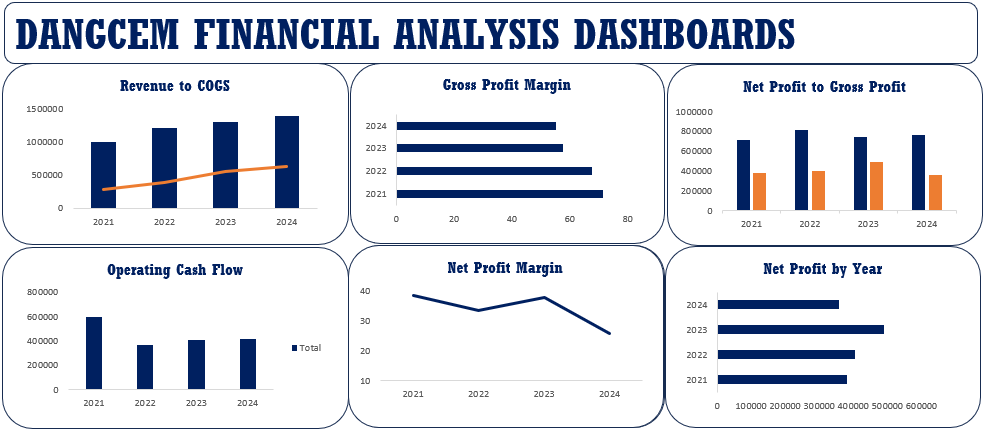
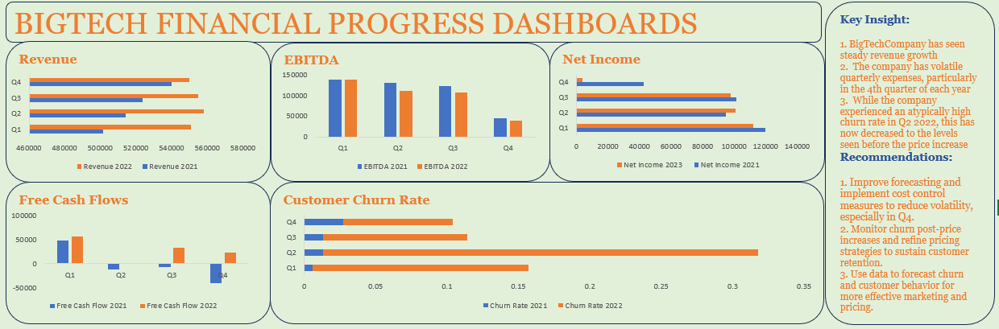
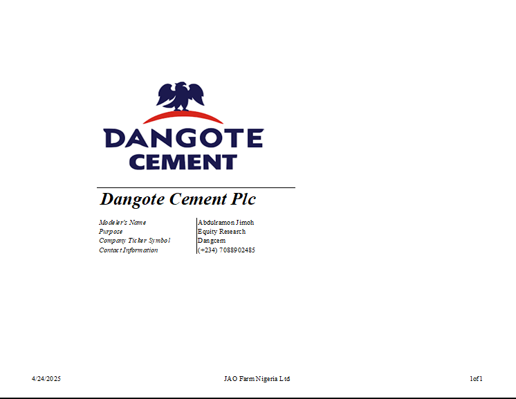

Hello! I'm Abdulramon Jimoh 🤓, a Financial Analyst, Financial Modeller, and Freelancer with a passion for turning data into actionable insights. With experience across Agribusiness,Real Estate, operations, finance, and customer service,  I help businesses make smarter decisions, solve financial challenges, and drive sustainable growth.
<!--Mention your top/relevant skills here - core and soft skills-->
## SKILLS

*As a Financial Analyst, I help businesses and startups understand their numbers and make smarter financial decisions.*

**- ✅ Financial Analytics .**
I provide in-depth analysis and tailored solutions to help you make data-driven decisions, optimize processes, visualize financial data, and drive business growth. 

**- ✅ Financial Modelling.**
I build dynamic models for forecasting, budgeting, valuation, and scenario planning.

**- ✅ Business Valuation.**
I use DCF and other methods to estimate company worth and support investor pitches

<!--Section 2: List 3-4 key projects-->
## MY PROJECTS 
*A glimpse of some of the projects I've been working on.*

**Dangote Cement PLC Financial Statement Analysis**
 
 
 Dangote Cement demonstrated solid top-line growth in 2022, supported by increased sales volume and strategic market expansion across Africa. Despite rising input costs, the company maintained a strong EBITDA margin, reflecting efficient operations and cost management.
 
 **BIGTECH Financial Analysis**
 

  Completed a Simulation focused on financial analysis as an Analyst on the technology team at an investment bank.•	Played a pivotal role in aiding senior bankers to determine the feasibility of establishing a partnership with BigTechCompany.
 
 **DANGOTE Cement PLC Financial Model**
  (
